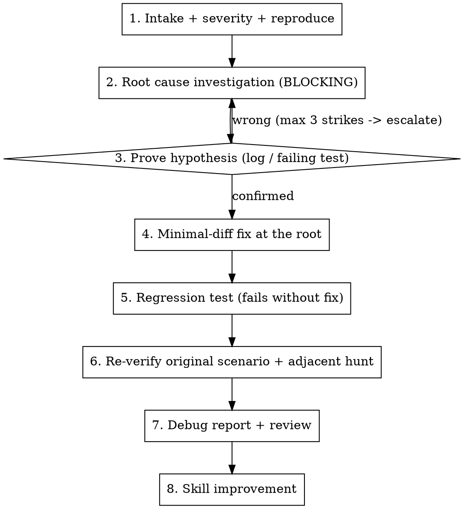

# bug-fixer - one command, one bug, root cause first

Drive a single bug from report to verified fix. The front half is a root-cause investigation, not a
guess at a fix. The value is the discipline: a plausible code path is a hypothesis, not a finding, and
a fix for a symptom only moves the bug somewhere harder to find.

**Iron Law:** NO FIX WITHOUT A CONFIRMED ROOT CAUSE. Find the cause, prove it, then fix.

## When to use / not use

- Use when: one reported defect, regression, crash or wrong-data case is to be taken end-to-end;
  "it was working yesterday"; intermittent failures; wrong or missing values after an operation.
- Don't use when: it is a new feature or story (use `story-implementer`); it is a pure code review;
  it is a support case that must first be read out of production logs (read the logs first, then come
  back here for the fix).

## Before you start

- **Read the project's `CLAUDE.md` and its docs index first.** They tell you the hosts, the test
  command, the build rules and the known traps. Project rules override the defaults in this file.
- **Builds:** follow the project's rule. If the user compiles in their IDE, do not run the full build
  or the full test suite; write the fix and the test, and tell them exactly what to run. A filtered run
  of the one new test is fine.
- **Notes and artifacts** go in a per-ticket folder the project already uses (for example
  `notes/<ticket>/`), never outside the repo.
- **Comments in code:** only the WHY that the code cannot say, one or two lines.
- **Verify before asserting.** Read every step of the code path before you claim a mechanism. Label
  each claim Verified (`file:line`) / Hypothesis (say what would confirm it) / Unknown. Evidence that
  contradicts a tidy theory wins; re-derive, do not explain it away. Retract loudly when wrong.
- **A check that survived verification can still be wrong.** A reviewer's "checked, clean" is the
  least-checked claim of all. Re-read the source, not the last verifier's summary.

## Workflow



### Phase 1 - Intake, severity, reproduce

- Collect symptoms: exact error text (quote it, do not paraphrase), stack trace, repro steps, which
  user / role / tenant / environment / client.
- **Severity** sets urgency and how wide a fix may reach: Critical (data loss, data visible to the
  wrong customer, production down) > High (feature broken, no workaround) > Medium (broken with a
  workaround) > Cosmetic.
- **Check recent changes.** A regression means the cause is probably in the diff:
  `git log --oneline -20 -- <affected-files>`.
- Reproduce deterministically where possible. If the bug cannot be run locally, build the repro as a
  **failing test or a traced path**, not a guess. Missing context: ask ONE blocking question at a time.

### Phase 2 - Root cause investigation (BLOCKING)

Trace the code path from the symptom back to the cause. Read **every step**: controller, service,
mapper, query, transform, client. The step you skip is the step that breaks the claim. Known traps:

- **Tenant / role** - the wrong tenant or role can reach the data; the two sides of a shared record
  (for example owner and partner, sender and receiver) run different code; a global query filter drops rows. Example: in an ORM, eager-loading a required navigation
  whose target is soft-deletable can silently drop the parent row. Project the columns instead.
- **Content is not identity** - on wrong or duplicate records, "these are the same object" is a claim
  about content, not identity. Trace the key that is created (id, GUID, primary key) from where it is
  created, through lookup, to write. Trace the key, not the payload. A key that is scoped to one side
  or one system gets re-created when that side changes.
- **Destructive paths** - delete, void, overwrite, dedup and reconcile are where data loss hides.
- **"Props arrive" is not "control visible"** - on a "control is missing" UI bug, measure the element
  first (`getBoundingClientRect`, `getComputedStyle`). A 0x0 element hidden by a CSS rule looks exactly
  like missing data, and tracing the data path will not find it.
- **Works locally, fails on a shared environment with 403 / 413** - suspect the gateway or web
  application firewall first. Local runs usually have none. Read its logs for the URL and rule before
  you read code.
- **Before you blame a config value, ask what set it.** If the code under review, a new default, or
  an open finding set that value, it is a code cause, not a config problem.
- Match against common patterns: race condition (intermittent), null propagation, partial writes,
  integration failure (timeout or bad response from an external system), config drift (works locally,
  fails in production), stale cache or stale query data.

Output one line: **"Root cause hypothesis: ..."** - specific, testable, with `file:line`. Do not write
a fix until Phase 3 confirms it.

### Phase 3 - Prove the hypothesis

Add a temporary log or assertion at the suspected cause, or write the failing test, and match the
evidence to the claim. Wrong? Gather more evidence and re-derive. Do not guess the next fix.

**3-strike rule:** three failed hypotheses -> STOP and escalate to the user. The problem is likely in
the design, not a simple bug. Bugs that keep coming back in the same files point the same way.

### Phase 4 - Minimal-diff fix at the root

- Fix the **root cause, not the symptom**. The smallest change that removes the actual problem. Do not
  refactor nearby code.
- Follow existing conventions. Ask the user only about a real decision the investigation could not
  settle, with your recommendation first.
- **Fix touches more than 5 files?** Stop and ask: proceed, split, or rethink. A wide bug fix usually
  means the wrong layer.
- **Adding a server-side check, filter or validator?** First list every client that calls the
  endpoint (web, desktop, background agents, old client builds still in the field) and handle a value
  that is absent or null. Test pass, refuse and absent, from each client. Real case: a request-size
  check refused every upload from a client that never sends `Content-Length`.

### Phase 5 - Regression test

**Every backend fix gets a regression test that fails without the fix and passes with it.** Use the
project's test stack and test command. A new test project copies a sibling project's setup exactly.
A UI-only fix with no test runner: record the click path you checked instead.

### Phase 6 - Re-verify and adjacent hunt

- Reproduce the **original** scenario and confirm it is gone. This is not optional. If you cannot run
  it, say exactly what the user must check. Never write "this should fix it".
- **Adjacent hunt:** other callers of the changed method, missing cache or query invalidation, the
  other side of the operation (sender and receiver, owner and shared-with party), other integrations that share
  the path, branches that are now dead.
- **Judge on the final tree.** A later commit can undo an earlier fix. Re-read the final diff, not your
  memory of the commits.

### Phase 7 - Debug report and review

Write the report, then run your code review skill (or ask for a review) on the diff:

```
DEBUG REPORT
Symptom:         [what the user saw]
Root cause:      [what was actually wrong, file:line]
Fix:             [what changed, file:line]
Evidence:        [repro before/after, or the failing -> passing test]
Regression test: [file:line, or the UI click path checked]
Adjacent:        [callers / invalidations / other side checked]
Status:          DONE | DONE_WITH_CONCERNS | BLOCKED
```

### Phase 8 - Skill improvement

Two to four concrete lines: what slowed the diagnosis, which trap this skill should have named, which
project convention was missing. Offer to add them to this file or to the project's `CLAUDE.md`.

## Quick reference

| Phase | Gate | Output |
|-------|------|--------|
| 1 Intake | severity set, repro or failing test | symptom + severity |
| 2 Root cause | every step read | hypothesis + file:line |
| 3 Prove | evidence matches (max 3 strikes) | confirmed cause |
| 4 Fix | root not symptom, 5 files or fewer | minimal diff |
| 5 Test | backend fix has a test | fails-without / passes-with test |
| 6 Verify | original repro gone + adjacent checked | evidence |
| 7 Report | review run | debug report |
| 8 Feedback | - | skill changes |

## Gotchas

| Mistake | Fix |
|---------|-----|
| Fix before a confirmed root cause | Iron Law. Phase 3 gates Phase 4. |
| One plausible path reported as the finding | It is a hypothesis until every step is read. |
| "Quick fix for now" | There is no "for now". Fix the root or escalate. |
| Symptom fix, then a new bug elsewhere | Wrong layer. Re-derive, do not patch again. |
| "Same object" on a wrong-data bug | Content, not identity. Trace the created key. |
| "Control is missing" traced through the data | Measure the element's size and style first. |
| New server check breaks one client | List every caller; handle absent values. |
| Trusting an earlier "verified" | Re-read the source yourself. |
| Refactoring nearby code during a fix | Minimal diff. Stay at the root cause. |
