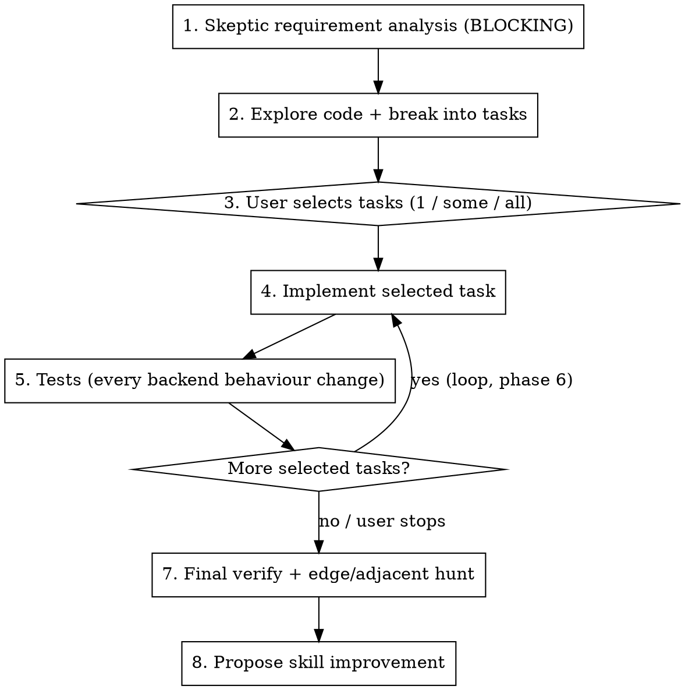

# story-implementer - one command, one user story

Drive a single user story from raw ask to verified, review-ready code. Eight phases, one of them a
loop. The value is up front: **Phase 1 is an adversarial requirement pass that runs before any
exploration or code.** Assume the story is underspecified and wrong until proven otherwise.

**Core principle:** skepticism first, code last. Every phase gate is explicit. Do not slide from
analysis into implementation before the user picks tasks.

## When to use / not use

- Use when: one scoped user story, ticket or feature ask is to be taken end-to-end, and the user wants
  the process driven.
- Don't use when: it is a known bug with a stack trace (use `bug-fixer`); it is a pure code review;
  it is a trivial one-line change (just make it).

## Before you start

- **Read the project's `CLAUDE.md` and its docs index first.** They name the hosts, the solutions or
  packages, the test command, the build rules and the coding rules. Project rules override this file.
- **Builds:** follow the project's rule. If the user compiles in their IDE, do not run the full build;
  tell them what to build. Name **every** build target that owns a changed file. A change to a shared
  library must name every host and client that consumes it, or one of them breaks unseen.
- **Merge the main branch into your branch before the PR opens**, and again if the main branch later
  changes the same files.
- **Notes and artifacts** go in a per-ticket folder the project already uses (for example
  `notes/<ticket>/`), never outside the repo.
- **Comments in code:** only the WHY that the code cannot say, one or two lines.
- Follow existing conventions first. Use general good practice only where the repo is silent.

## Workflow

### Phase 1 - Skeptic requirement analysis (BLOCKING)

Before exploring or coding, read the story assuming it is incomplete. Produce, then **stop and wait
for answers to the blocking questions**:

- **Ambiguities** - every term or scope that can be read two ways.
- **Edge cases** - empty, null, max, concurrent, duplicate, partial failure, retry, ordering.
- **Tenants, roles, security** - tenant isolation, data visible to the wrong customer, role gates,
  differences between the sides of a shared record (for example owner and partner). Assume the wrong tenant or role can reach the data until you
  have read the gate.
- **Destructive paths** - delete, void, overwrite, dedup, reconcile. "Handled automatically" is a flag
  to trace, not a reassurance. Trace the identity key (id, GUID, primary key) from where it is created,
  through lookup, to write. Same content is not the same identity.
- **Backward compatibility** - existing records, existing configuration, old clients still in the
  field. A new default applies only to new records or to a field the user changes in this session,
  never when an existing record is merely opened, and only to the exact case in the story. Each change
  that an existing record or an old client can see gets a release-note line in the PR and a question
  to the product owner.
- **Story vs your decision** - where your plan differs from a sentence in the story, ask the product
  owner in your tracker before the PR opens. Building against a side note instead of the story is a
  common source of rework.

Present findings and numbered blocking questions. **Nothing proceeds until the blocking ones are
answered.** Label each finding Verified (`file:line`) / Hypothesis (say what would confirm it) /
Unknown.

### Phase 2 - Explore and break down

Trace the real path end to end (use a search subagent for wide reads). Map the layers touched, for
example UI -> API -> service -> data access -> database. Then split the story into **small,
independently shippable tasks**, each one a coherent slice, not a layer.

- **Build the minimum for the actual path, and keep concerns separate.** Before you reuse a bulk or
  shared method, check what it assumes. Real case: reusing a bulk method tied two features together
  (saving and storage) and forced a rework PR.

**Entry-point table before code.** For each rule you add or change, list every place that must apply
it: create flow, editor, viewer, duplicate; each side of a shared record; send and receive; each integration;
server check and client check; each reader of the value. Mark each row "changed", "not needed because
...", or "missed". Save it in the notes folder. Do not start Phase 4 with an empty row.

### Phase 3 - User picks tasks

Present the task list as a multi-select question. The user takes one, several or all. Do not start
until they pick.

### Phase 4 - Implement the selected task

- **Ask only about real decisions** the analysis could not settle, recommendation first. Otherwise
  follow existing conventions silently; do not invent choices.
- Small, focused diffs. Match surrounding naming, structure and comment density. Use the project's
  UI component wrappers and design tokens, never hand-written values the design system owns.
- **Adding a server-side check, filter or validator?** First list every client that calls the
  endpoint (web, desktop, background agents, old client builds) and handle a value that is absent or
  null. Test pass, refuse and absent, from each client. Real case: a request-size check refused every
  upload from a client that never sends `Content-Length`.
- **New user-facing text:** at most two short sentences, words the UI already uses (grep the UI
  source), no internal jargon. A message that tells the user what to do must still be true after the
  last commit. Do not change existing visible text unless the story asks.

### Phase 5 - Tests

**Every backend behaviour change gets a unit test in the same PR.** Use the project's test stack and
test command; run a filtered run of the new tests. A new test project copies a sibling project's setup
exactly. UI-only changes with no test runner: record the click path you checked instead.

### Phase 6 - Loop

Return to Phase 4 for the next selected task, until all selected tasks are done or the user says stop.

### Phase 7 - Final verification and adjacent hunt

- **Judge on the final tree.** Re-read the actual diff, not your memory of it, against the Phase 1
  findings. A later commit can undo an earlier one. Each edge case is handled or consciously deferred.
- Evidence before assertions. If you cannot run it, say what the user must check; do not claim it
  passes.
- **A check that survived verification can still be wrong.** A reviewer's "checked, clean" is the
  least-checked claim. Re-read the source, not the last verifier's summary.
- **"Props arrive" is not "control visible".** For UI work, measure the element on screen
  (`getBoundingClientRect`, `getComputedStyle`), do not stop at the data reaching the component.
- Hunt **adjacent issues** the change exposes: callers now wrong, missing invalidations, tenant or role
  gaps, dead branches.
- **Pre-PR gate.** Answer each before the PR opens:
  - **Criteria trace.** One row per acceptance criterion and per tracker comment, with `file:line` and
    the test. A row with no code is either a fix or a question to the product owner. A value that only
    tests read does not count as done.
  - **Comments.** Each comment that names a method: does it still exist? Each comment that states a
    rule: is it still true after the last commit? When a commit changes a rule, `git grep` the branch
    for the old wording. Grep added lines for `TODO`, `FIXME` and stray text.
  - **Dead members.** `git grep` each new member, DTO property, prop and optional parameter. Only tests
    read it? Delete it or wire it. Before a new query or helper, grep for one that already does the
    same thing.
  - **Project rules.** Check the changed files against the project's frontend and backend rules
    (hard-coded styles, inline style objects, raw library components where a wrapper exists, very long
    methods, logging rules).
- Run your code review skill (or ask for a review) before calling it review-ready. Open the PR as a
  draft; publish it only when no medium-or-higher finding is left unhandled.

### Phase 8 - Skill improvement

End every run with two to four concrete lines: what slowed this story down, what this skill should have
said, which project convention was missing. Offer to add them to this file or to the project's
`CLAUDE.md`.

## Quick reference

| Phase | Gate | Output |
|-------|------|--------|
| 1 Analyze | blocking questions answered | findings + edge cases + risks |
| 2 Explore | traced end to end, entry-point table full | task list |
| 3 Pick | user selects | chosen tasks |
| 4 Build | decisions settled | diff |
| 5 Test | backend change has a test | tests, or UI click path |
| 6 Loop | tasks remain | back to 4 |
| 7 Verify | final diff re-read + review run | punch list |
| 8 Feedback | - | skill changes |

## Gotchas

| Mistake | Fix |
|---------|-----|
| Sliding from Phase 1 into code before the user picks tasks | Phase 3 is a hard gate. Stop. |
| Treating the story as complete | It is underspecified until proven. That is Phase 1's whole job. |
| "Handled automatically" on a delete or dedup path | Trace the identity key from creation to write. |
| New server check breaks one client | List every caller; handle absent values. |
| Backend behaviour change with no test | Write the test. UI-only: record the click path. |
| One giant task | Split into independently shippable slices. |
| Reusing a bulk method blindly | Check what it assumes; keep concerns separate. |
| Shared library change, one consumer not built | Name every build target that consumes it. |
| Trusting an earlier "verified" | Re-read the source yourself. |
